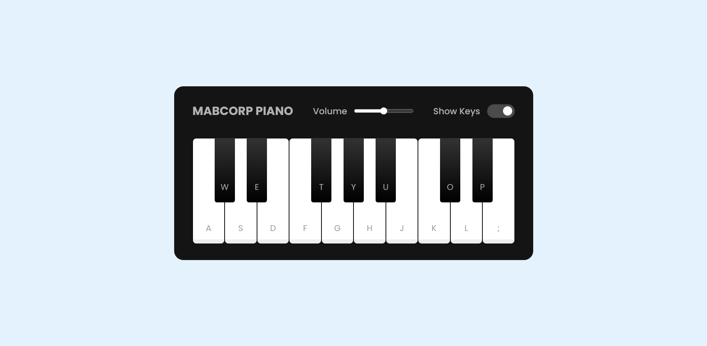

  

<h1 align="center">
  Playable PIANO
</h1>

<h3 align="center">
  Virtual Technology
</h3>

  

A Playable PIANO using HTML, CSS, and JavaScript. The user can play various tunes on this piano by clicking on the keys or using the keyboard keys. Users can also adjust the volume and show or hide shortcut keys on the piano. 
Using JavaScript to build a playable piano can be a fun and challenging way to learn and improve your coding skills. This repository will teach you How to Make A Virtual Playable PIANO in HTML, CSS, and JavaScript from scratch that can be played directly in a web browser. If you don’t know, a piano is a musical instrument that produces sound by striking a series of keys or notes on a keyboard. On my piano, users can play various tunes by clicking on the keys or using the keyboard keys. They can also adjust the volume and show or hide shortcut keys on the piano. Because of its responsiveness, this piano also works smoothly on touch devices like phones  

  
<!-- ................................................................................................................................. -->

### Features
 
Following are some of the new features and learning encountered while creating this amazing project:

- Created a toggle switch for show/hide keys option using css only
- Tunes are activated by using both the mouse and keys. So this can be used both by mouse and keyboard
- Use of Audio files using JS Audio element is learnt 
- Handling the volumn as per the user requirement 
- Completely Responsive

  
<!-- ................................................................................................................................. -->

### Resources
 
Follwing resources have been used in maintaining this project:

- [Google Fonts](https://fonts.google.com/) for importing the <b>Poppins Family</b>.

  
<!-- ................................................................................................................................. -->

### Demo

  The Demo of this working project can be found on  
  <a href="https://rebrand.ly/VirtualPiano_MABCORP">https://rebrand.ly/VirtualPiano_MABCORP</a>

  
<!-- ................................................................................................................................. -->

### Video

You can exclusively watch the video on this project from the making to deploying on my     channel with the link given below 

  [Video Link](# )  

  If you like my video then do Like the Video and share it with others.

  
<!-- ................................................................................................................................. -->

### Graphical User Interface

  
<!-- ................................................................................................................................. -->

### Technology Stack
 
Follwing technologies have been used at the core of this application to make it stand in the market place:

- HTML
- CSS
- JavaScript

  
<!-- ................................................................................................................................. -->

### Advancement

> Nothing Recommended Yet
  
<!-- ................................................................................................................................. -->

### Deployment Details

The website is deployed using the free hosting provided by **Vercel**

  

  
Later on the link was customized using the well-known URL shortener and customizer **Rebrandly**:  

  

  
<!-- ................................................................................................................................. -->

### Developer

Muhammad Abdullah Butt  
abdullahbutt12292210@gmail.com  
> [Instagram](https://www.instagram.com/abdullah.butt.22/) 
> [FaceBook](https://www.facebook.com/profile.php?id=100076291614529) 
> [YouTube](https://www.youtube.com/channel/UCnuOFQyMywg-KuoN-lmav1Q) 
> [Portfolio](https://rebrand.ly/MuhammadAbdullahButt_MABCORP) 
> [Project Displayer]( https://rebrand.ly/ProjectDisplayer_MABCORP)
  
<!-- ................................................................................................................................. -->

